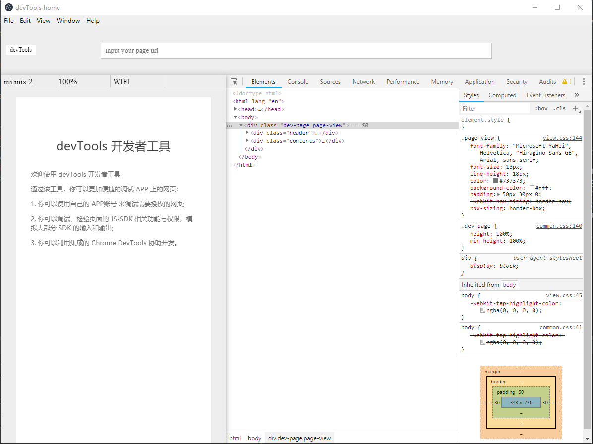

# devTool
> 开发者工具


## 解决的问题
- 部署到第三方APP的代码调试！

- 第三方服务接入到APP的调试！
> 客户端 **\[类似微信开发者工具公众号模式\]** ：采用 **electronjs** 构建跨平台应用。集成浏览器内核 & 客户端插件，构建基本的模拟运行环境！
> 
> 服务：采用扫码验证之后，自动构建一个本地或者公网 **服务** 。客户端临时访问该服务！
> 
> 调试 **\[类似微信开发者工具小程序模式\]** ：采用google开源的 **devtools** 代理客户端和服务端,连接真机和客户端间的断点和其他常见调试！ 

## 进度
- 客户端 版本核心功能基本完成！
> 1、插件功能实现，更多模拟功能待丰富！

- 服务
> 相对容易！

- 调试
> 方案一：
```bat
http://web.jobbole.com/84281/  

不知道客户端支持像pc端这样 带参数的打开浏览器（你们可能是手机浏览器内核啥的）渲染页面吗？
$ start "" "C:/Program Files (x86)/Google/Chrome/Application/chrome.exe" --args --remote-debugging-port=9222 

相当于PC端起了一个服务，供远程查看激活的页面！（这样实现的工作量最小）
```
> 方案二：
```bat
待定暂无思路！
```


## uses
- npm install --save-dev
- npm run start

> 效果
 

## todo
- [x] 窗口布局：let view = new BrowserView({})
- [x] 采用class格式编写维护
- [x] 自定义展示 devTools 的功能区域
- [ ] 类 方法&属性私有化的处理 待优化 \[暂时 **_标识** & 同时不要去直接调用私有化的方法和属性，避免后续改造完影响正常使用] 
- [x] select 小于 100% 时显示bug!
- [x] renderWindow 中 contentHeight 设置问题！
- [x] renderWindow 滚动事件监听
- [x] 三个抖动 性能优化(简化版实现)
- [ ] BrowserView 被遮挡问题
- [x] 打包输出 package 
- [ ] mac 适配
- [ ] 退出杀掉系统进程

## 语法
- [ ] export default  class Main {
- [ ] func=()=>{}

## bugs
- [x] setDevToolsWebContents ：一片空白。亟待解决

## download
> windows 
### v 0.0.1
- https://uiorpm.github.io/electron/out/Electron%20DevTools-win32-ia32.rar
- https://github.com/UIorPM/electron/releases/download/0.0.1/Electron.DevTools-win32-ia32.rar
- https://github.com/UIorPM/electron/blob/master/out/Electron%20DevTools-win32-ia32.rar
### v 0.0.1
- https://uiorpm.github.io/electron/out/Electron_DevTools-win_0.0.2.rar
- https://github.com/UIorPM/electron/blob/master/out/Electron_DevTools-win_0.0.2.rar